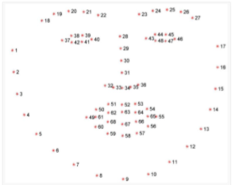
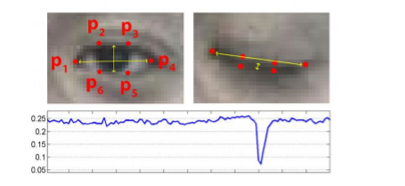
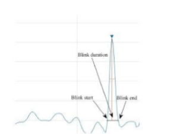

# Drowsiness Detection

This project uses OpenCV, dlib, and facial landmarks to detect blinks and drowsiness from a webcam feed. It shows an on-screen alert and can play an alarm sound when the user appears drowsy.

## Features

- Real-time webcam monitoring
- Blink counting
- Drowsiness alert based on eye aspect ratio
- Optional alarm sound
- Video output recording

## Project Images

### Face Detection



### Eye Landmark View



### Eye Aspect Ratio



## Requirements

- Python 3.8 or newer
- A working webcam
- The dlib landmark model file at `models/shape_predictor_70_face_landmarks.dat`

## Install

Create and activate a virtual environment, then install the dependencies:

```bash
pip install opencv-python dlib numpy scipy playsound
```

If you do not already have the landmark model, download it and place it here:

```text
models/shape_predictor_70_face_landmarks.dat
```

## Run

```bash
python blinkDetect.py
```

## Files

- `blinkDetect.py` - main blink and drowsiness detection script
- `alarm.wav` - alarm sound played during drowsiness
- `output-low-light-2.avi` - recorded output video generated by the script

## Notes

- Press `Esc` to exit the program.
- Press `r` while the program is running to reset the blink and drowsiness state.
- If face detection is unreliable, make sure lighting is good and the webcam is working properly.